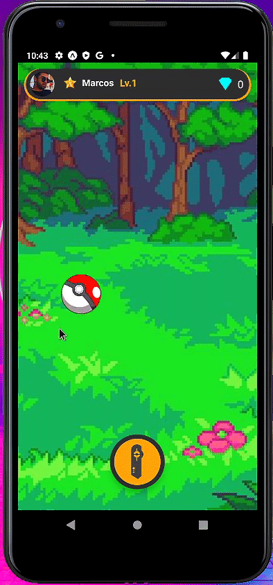
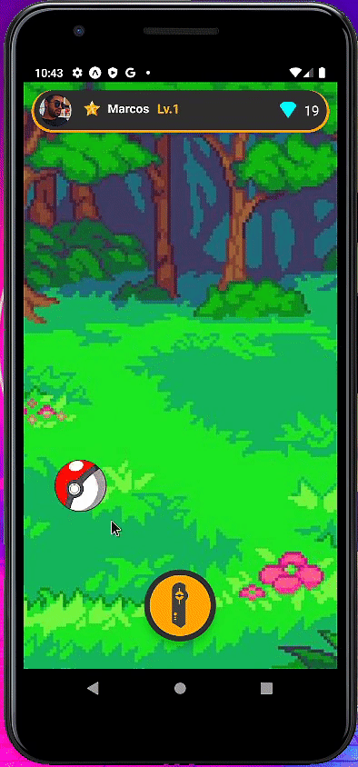
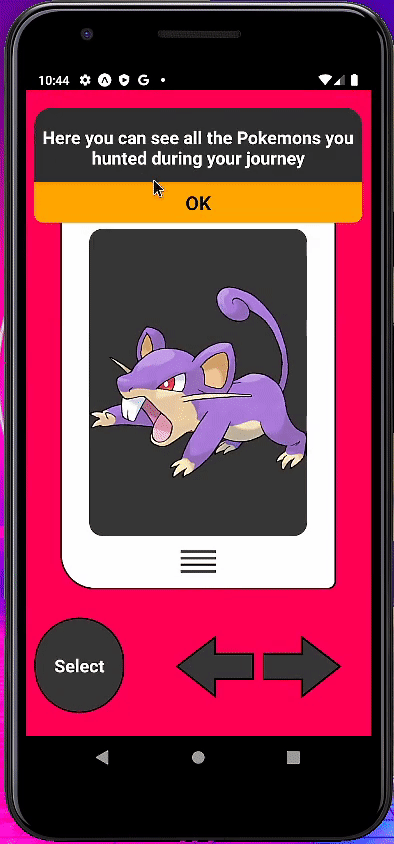

<h1 align="center">
    
</h1>

<h2 align="center">Projeto de jogo baseado no anime Pokémon.</h2>

<h3 align="center"> Stacks utilizadas  React Native e  Expo.

## 📝 O Projeto
O projeto foi desenvolvido por mim para aprimorar os meus conhecimentos com a ferramenta React Native e será disponibilizado para qualquer desenvolvedor interessado em aprender/estudar as ferramentas utilizadas.
No geral neste projeto utilizei:
- Expo,
- ContextAPI,
- API RESTful, [PokéAPI](https://pokeapi.co/),
- Animated,
- Gesture Handler,
- Pan Responder,
- Axios,
- Lottie,
- State,
- Uncontrolled Components entre outros.

## 🧐 Como funciona o jogo?

O jogo consiste em arrastar a pokebola pelo mapa ( tela do dispositivo ) até encontrar um pokémon.
Cada Pokémon possui uma quantidade de Diamantes, que irão se acumular e aumentar o seu nível de Mestre Pokémon.
Todos os pokémons econtrados estão presentes em sua Pokédex.

## 🚀 Como jogar?

Assumindo que você já possua o React Native disponível em sua máquina.

Você deve ter instalado o [NodeJS](https://nodejs.org/pt-br/)
Após instalação, abra o seu terminal e digite: 
> node -v

O resultado deverá ser a versão do seu NodeJS

Você também deve ter instalado a ferramenta de versionamento [GIT](https://git-scm.com/)
Após instalado, abra o seu terminal e digite:
> git clone https://github.com/marcospgsilva/PokeHunter.git

Você também precisará do Expo instalado.
Abra o seu terminal e digite para instalá-lo:
> npm install expo-cli --global

Certificando-se que todos os pré-requisitos foram cumpridos.
Acesse o diretório onde foi clonado o repositório.
Ele irá se chamar PokeHunter.

Abra o seu terminal nesta pasta e rode o comando:
>npm install

Este comando irá fazer a instalação de todas as dependências da pasta Node_Modules.

Após finalizado, rode o comando:
>expo start

Pronto, o aplicativo está pronto para uso.

## 🔧 Para DEVS

Ao ser carregada, a tela principal ( a que contém o mapa ) gera de forma aleatória uma região no mapa, onde será "encontrado" o pokémon.
Utilizando Gesture Handler e Pan Responder, é possível saber qual é a posição atual do toque na tela. 

Desta forma, o algoritimo faz a comparação para saber se a posição do toque está dentro da região definida anteriormente.

Assim que a posição é verdadeira, o processo de consumo da API é iniciado utilizando o Axios.
Esta requisição nos retorna várias informações e dentre elas, a imagem do pokémon.

OBS: Apesar da PokéAPI ser incrível, as imagens que ela fornece não possuem boa resolução. Logo, utilizei o pokeres.bastionbot.org para pegar estas imagens.

Neste momento entra em ação a utilização ( de forma direta e mais óbvia ) de State, fazendo com que a pokebola pare de ser renderizada e começe o processo de animação/renderização do card principal.

Um array é utilizado para guardar todos os pokémons ( e suas informações que serão posteriormente utilizadas ) e será utilizado para renderizar os pokemons na tela de Pokédex.

Algumas funcionalidades ainda não foram adicionadas, como adição de DB para salvar todo o progesso.
Criação de conta entre outros também não foram adicionados, pois este não era o meu objetivo neste projeto.

Para todos que tenham interesse/dúvidas relacionadas ao projeto, estarei disponível em todas as minhas redes sociais.

## ✍️ Author 

👤 **Marcos Gomes**

* Instagram: [@marcospgsilva_](https://www.instagram.com/marcospgsilva_/)
* LinkedIn: [@marcospgsilva](https://www.linkedin.com/in/marcospgsilva/)
* Github: [@marcospgsilva](https://github.com/marcospgsilva)

